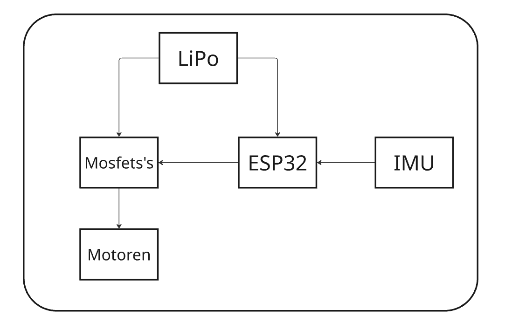

# Operation-Steinadler ESP32-Drone
-----------------------------------------

# Developers

|Name|E-Mail| |
|----|------|-|
|Emil Schoberegger|emil.schoberegger@bulme.at|Team Manager, Hardware-Design|
|Zsigmond Szalay|zsigmond.szalay@bulme.at|Software, Testing|
|Timo Trummer|timo.trummer@bulme.at|Simulation, Software, Testing|

# Defining the Features

|Must Have|Nice to Have|
|---------|------------|
|Flying|Soft Landing|
|Control|Automatic Height Control|
|Wireless||
|BMS||

# Blockschematic

